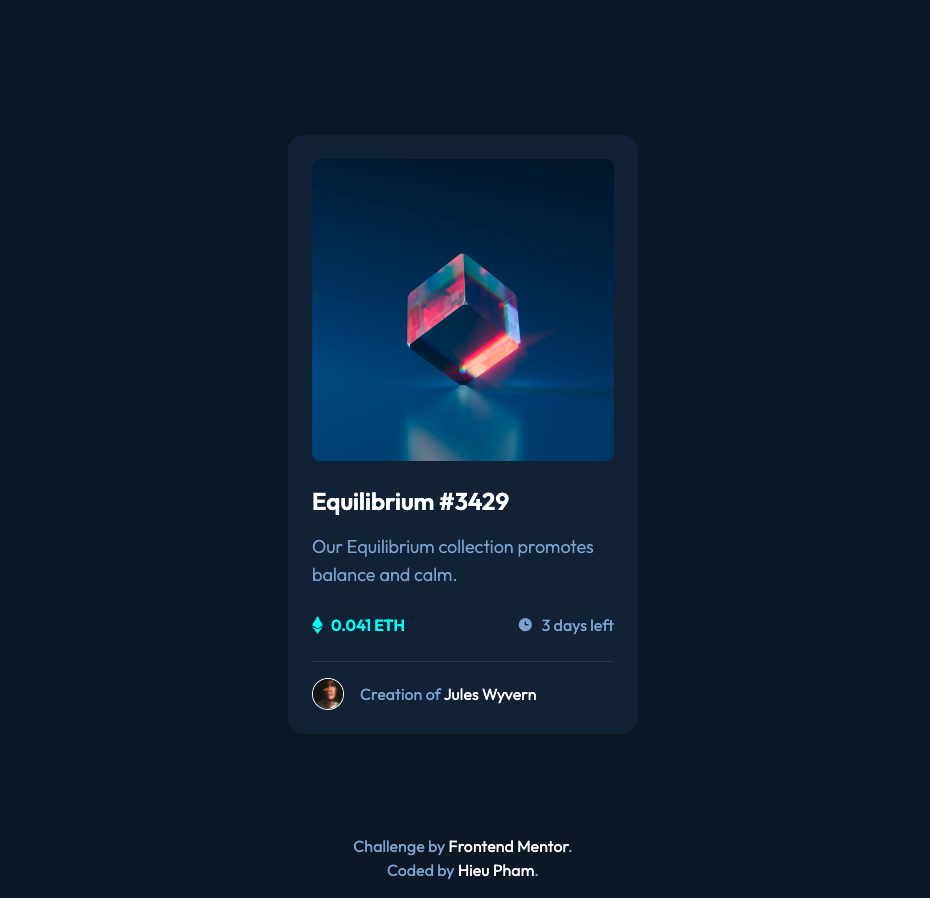

# Frontend Mentor - NFT preview card component solution

This is a solution to the [NFT preview card component challenge on Frontend Mentor](https://www.frontendmentor.io/challenges/nft-preview-card-component-SbdUL_w0U). Frontend Mentor challenges help you improve your coding skills by building realistic projects.

## Table of contents

- [Overview](#overview)
  - [The challenge](#the-challenge)
  - [Screenshot](#screenshot)
  - [Links](#links)
- [My process](#my-process)
  - [Built with](#built-with)
  - [What I learned](#what-i-learned)
  - [Useful resources](#useful-resources)
- [Author](#author)

## Overview

### The challenge

Users should be able to:

- View the optimal layout depending on their device's screen size
- See hover states for interactive elements
- Build out the project to the designs inside the `/design` folder. You will find both a mobile and a desktop version of the design.
- You will find all the required assets in the `/images` folder. The assets are already optimized.
- There is also a `style-guide.md` file containing the information you'll need, such as color palette and fonts.

### Screenshot



### Links

- Solution URL: [nft-preview-card-component](https://www.frontendmentor.io/solutions/tailwindcss-nodejs-3Nr5L-Oey)
- Live Site URL: [nft-preview-card-component](https://hieupm2096.github.io/nft-preview-card-component/)

## My process

### Built with

- Semantic HTML5 markup
- TailwindCSS
- NodeJS - to install TailwindCSS
- Flexbox - with TailwindCSS

### What I learned

Setup a project using TailwindCSS and build a static website.

Show and hide elements when hovering:

```html
<div class="relative cursor-pointer">
  <div
    class="absolute flex justify-center items-center inset-0 bg-cyan/50 opacity-0 hover:opacity-100 rounded-lg"
  >
    
  </div>
  
</div>
```

Center `div` horizontally and vertically inside another `div`

```html
<div class="h-screen flex">
  <div
    class="m-auto flex flex-col bg-card-background w-[350px] p-6 rounded-2xl shadow-md"
  >
    ...
  </div>
</div>
```

### Useful resources

- [TailwindCSS](https://tailwindcss.com/docs/) - TailwindCSS official docs.

## Author

- Frontend Mentor - [@hieupm2096](https://www.frontendmentor.io/profile/hieupm2096)
- Github - [@hieupm2096](https://github.com/hieupm2096/)
- Twitter - [@hieupm2096](https://www.twitter.com/hieupm2096)
